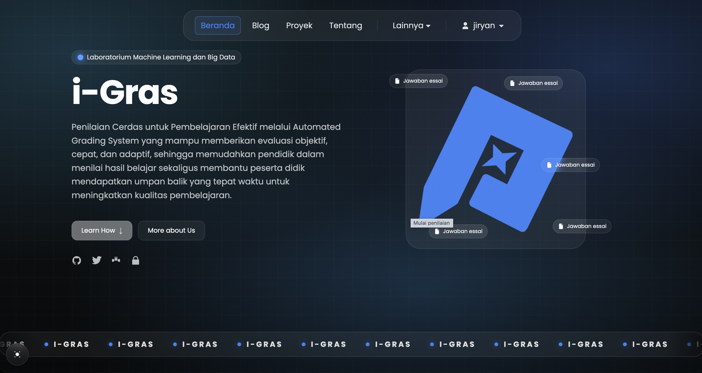
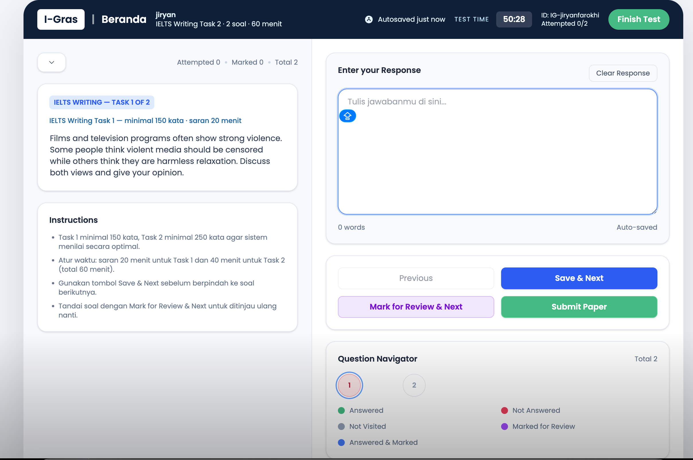
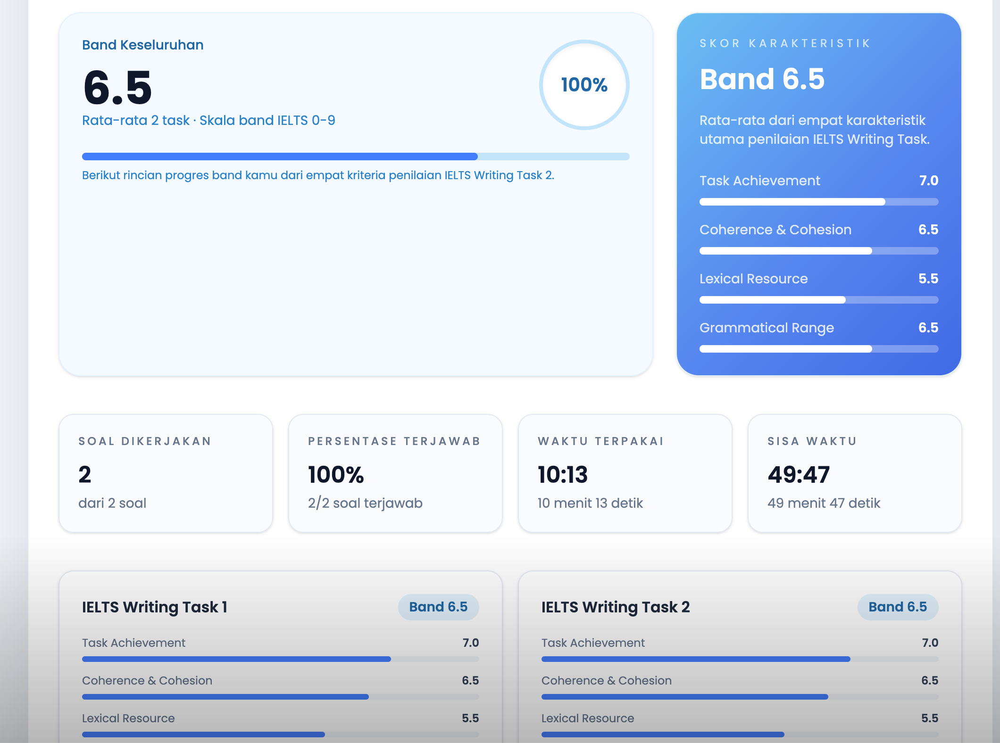

# iGrass — Intelligence Grading System

Website ujian essay dengan **Automated Grading System** berbasis machine learning.
Seringkali penilaian essay secara manual membutuhkan waktu yang lama — iGrass mengotomatisasi
penilaian ujian siswa/mahasiswa secara efisien, cepat, dan akurat (saat ini berbasis soal IELTS).

**Demo:** https://igras.vercel.app

---

## Alur Aplikasi

```
┌──────────┐   submit essay   ┌──────────────────┐   POST /predict/both   ┌─────────────────────┐
│  Browser │ ───────────────▶ │  Next.js (Vercel) │ ─────────────────────▶ │  Model API (FastAPI) │
│  user    │                  │  /api/exam        │                        │  SBERT + XGBoost     │
└──────────┘                  └────────┬─────────┘ ◀───────────────────── └─────────────────────┘
                                       │                    skor 4 trait
                                       │ simpan skor        ┌─────────────────────┐
                                       └──────────────────▶ │  Supabase (Postgres) │
                                                            └─────────────────────┘
```

1. User mengerjakan 2 task IELTS Writing acak (60 menit, minimum 150/250 kata) di `/exam`.
2. Saat submit, Next.js mengirim teks essay ke model API (`MODEL_API_URL/predict/both`).
3. Model menyeragamkan teks via **SBERT `all-mpnet-base-v2`** (embedding + panjang essay) →
   **XGBoost multitask** memprediksi 4 trait:
   Task Achievement · Coherence & Cohesion · Lexical Resource · Grammatical Range.
4. Rata-rata tiap trait dibulatkan ke **kelipatan 0,5** (konvensi band IELTS), lalu disimpan ke
   tabel `scores` dan ditampilkan di halaman skor.

## Model Machine Learning

- **XGBoost multitask learning** (satu model per trait; `model/xgb_models_all.joblib`).
- **Sentence Transformers** (`all-mpnet-base-v2`) untuk vektorisasi teks; fitur = embedding
  + panjang essay.
- Notebook pembuat model:
  https://www.kaggle.com/code/jiryanfarokhi/bdc-internal-satria-data
- Service FastAPI: `model/app.py` — endpoint `/predict/essay|avg|both` (JSON) dan varian `/csv`.

## Deployment Model — 3 Opsi

`model/` di-deploy terpisah (tidak ikut Next build). CMD Dockerfile membaca `$PORT`.

| Opsi | File | Status | Catatan |
|---|---|---|---|
| **Modal** (utama) | `model/modal_app.py` | Produksi | Scale-to-zero, cold start singkat, gratis dalam batas kredit bulanan |
| **Render** (alternatif) | `model/render.yaml` | Siap pakai | Selalu-on, tanpa cold start, ~$7/bulan |
| **Snowflake SPCS** (eksperimen) | `model/spcs/` | Eksperimental | Lihat di bawah |

Bagian **Snowflake SPCS** adalah hasil eksperimen hosting model di Snowflake
(`model/spcs/README.md` berisi panduan + hasil pengukuran):

- Deployment via `model/spcs/deploy.sh` (Snowflake CLI + docker, image `linux/amd64`).
- Cold start penuh terukur **±156 detik** (provisioning node + pull image ~2 GB + load SBERT) —
  jauh lebih lambat dari Modal; warm request konsisten < 1 s.
- Endpoint publiknya **wajib auth Snowflake** (header PAT), sehingga bukan drop-in `MODEL_API_URL`.
- Pola operasi hemat: `ALTER SERVICE ... SUSPEND` saat tidak dipakai + pool
  `AUTO_SUSPEND_SECS=300` → idle = $0.

## Opsi Eksperimen: Snowflake (Data & Analitik)

Pipeline pemanfaatan Snowflake sebagai warehouse analitik (bukan menggantikan database
operasional — app tetap pakai Supabase untuk OLTP):

```bash
node tools/export-scores-to-snowflake.mjs   # ekspor users/questions/scores dari Supabase ke CSV
snow sql -f snowflake/load_analytics.sql    # staging -> tabel -> query analitik & monitoring biaya
```

- Panduan belajar lengkap (setup trial, CLI, konsep, UDF): **`snowflake/README.md`**.
- Dashboard pengganti Snowsight Dashboards (deprecated): **`snowflake/streamlit_dashboard.py`**
  (Streamlit in Snowflake) — KPI, distribusi band, tren bulanan, skor terbaru per user.
- Bagian Snowflake bersifat **eksperimental** dan sengaja belum di-push ke remote —
  produksi masih terikat Modal.

## FrontEnd

- Next.js 15 App Router + React 19 + TypeScript strict + Tailwind CSS v4 (Turbopack untuk
  dev & build). Node 24.x.
- Halaman: home, auth (`login/signup/forgot/reset`), dashboard, exam + score.
- Komponen UI terpisah di `src/app/components/` (navbar, theme-toggle, main-wrapper, dll).

## Backend

- API route handler Next.js di `src/app/api/` — auth (`login/logout/register/session/forgot/reset`),
  `exam` (GET skor terbaru / POST submit-essays), `admin/scores`.
- **Autentikasi custom** (bukan Supabase Auth): tabel `users` menyimpan scrypt
  password hash + salt (`src/app/lib/server/auth.ts`); session = cookie signed `igras_session`
  (7 hari) dengan `AUTH_SECRET`.
- **Supabase dipakai sebagai database saja** (3 client di `src/app/lib/supabase/`).
  Skema dikelola manual via `sql/schema.sql` + seed `sql/*_rows.sql` (no migrations).
- `tools/hash-password.mjs` untuk generate hash+salt saat seeding user.

## Menjalankan Lokal

```bash
npm install
npm run dev        # http://localhost:3000
```

Env yang dibutuhkan di `.env.local` (tidak dicommit):
`NEXT_PUBLIC_SUPABASE_URL`, `NEXT_PUBLIC_SUPABASE_ANON_KEY`, `SUPABASE_SERVICE_ROLE_KEY`,
`MODEL_API_URL` (URL Modal), `AUTH_SECRET`.

Verifikasi sebelum commit: `npx tsc --noEmit` → `npm run lint` → `npm run build`.

## Referensi

Dadi, Ramesh (2023). A Multitask Learning System for Trait-based Automated Short Answer
Scoring. *International Journal of Advanced Computer Science and Applications*.
DOI:10.14569/IJACSA.2023.0141048

https://sbert.net/

## Potensi Improvement

- Model feedback kualitatif dari jawaban user (Automated Writing Evaluation / AWE).
- Jenis soal selain IELTS (perhitungan matematis, definisi & konsep ilmiah).
- Integrasi dengan sistem ujian sekolah/universitas.
- Monitoring biaya & performa model API (latensi p95, cold start tracking).

## UI


